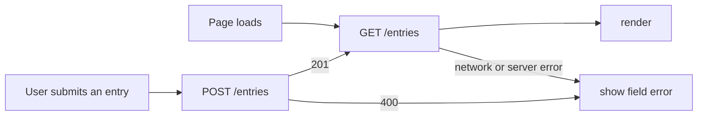

# Opt-in Directory

HW5 delegates F-04: a static guide to typical work by line of business, with illustrative summaries to help interns prepare questions before an informal conversation. The HW4 baseline is [mgt3745-hw4](https://github.com/mehtaaashi05/mgt3745-hw4).

The project helps interns find employees willing to have a short, informal conversation about another team, without turning curiosity into a formal transfer request. It serves the hesitant explorer and proactive outreacher described in [PROJECT.md](context/PROJECT.md) and [FEATURES.md](context/FEATURES.md).

Directory entries are stored in Cloudflare D1 behind a Worker, so they survive cleared browser data and can be read by another client. The data boundary and alternatives are recorded in [ADR-002](context/ARCHITECTURE.md).

## See It Work

The deployed endpoint is `https://mgt3745-hw4.mgt3745-hw4.workers.dev/entries`.

## How to Run

Deployed Worker: `https://mgt3745-hw4.mgt3745-hw4.workers.dev/`

From a fresh Codespace:

1. Open the repository in a Codespace. The devcontainer installs xdg-utils and runs `npm install`.
2. `npx wrangler login --device`, then follow [docs/SESSION_B_COMMANDS.md](docs/SESSION_B_COMMANDS.md)
   to create the database, run the schema, and deploy.
3. Paste the deployed URL into `app.js` as `API`.
4. Right-click `index.html`, choose **Open with Live Server**.

Run the code eval: API: `https://mgt3745-hw4.mgt3745-hw4.workers.dev/entries

To run the Worker locally instead: `npm run dev` (port 8787, local D1 emulator).

## Status

- **Code:** `npm test` with `API=<worker url>`; 8 tests, 8 passing. Screenshot in README.
- **Judgment:** docs/JUDGMENT.md, 12 questions, two graders, agreement 92%.

## Delegation
[DDR-001](docs/DDR-001.md): feature, tool, net hours

[DDR-002](docs/DDR-002.md): the HW4 Copilot delegation, written up

[COMPARISON](docs/COMPARISON.md)]

## Links

Reading order for a stranger: [PROJECT.md](context/PROJECT.md) →
[USERS.md](context/USERS.md) → [FEATURES.md](context/FEATURES.md) →
[ARCHITECTURE.md](context/ARCHITECTURE.md) → [STANDARDS.md](context/STANDARDS.md) →
[TOOLS.md](context/TOOLS.md) → [STYLE.md](context/STYLE.md) → [EVALS.md](context/EVALS.md) → [SKILLS.md](context/SKILLS.md)
[CLAUDE.md](context/CLAUDE.md)

## AI Use
Every delegation has a DDR under Delegation above. Hours spent on this assignment: 9.5.