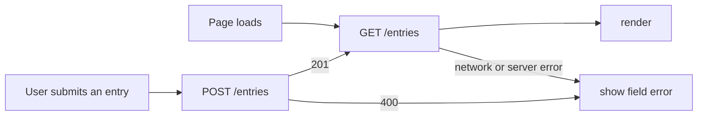

# Opt-in Directory

HW5 delegates F-04: a static guide to typical work by line of business, with illustrative summaries to help interns prepare questions before an informal conversation. The HW4 baseline is [mgt3745-hw4](https://github.com/mehtaaashi05/mgt3745-hw4).

The project helps interns find employees willing to have a short, informal conversation about another team, without turning curiosity into a formal transfer request. It serves the hesitant explorer and proactive outreacher described in [PROJECT.md](context/PROJECT.md) and [FEATURES.md](context/FEATURES.md).

Directory entries are stored in Cloudflare D1 behind a Worker, so they survive cleared browser data and can be read by another client. The data boundary and alternatives are recorded in [ADR-002](context/ARCHITECTURE.md).

## See It Work

The deployed endpoint is `https://mgt3745-hw4.mgt3745-hw4.workers.dev/entries`.

## How to Run

Install dependencies with `npm install`. For a new database, initialize the schema with `npm run db:schema`.

Run the Worker locally with `npm run dev` (port 8787). Serve `index.html` on `127.0.0.1:5500` with Live Server. Deploy with `npm run deploy`. Run the deployed API checks with `API=https://mgt3745-hw4.mgt3745-hw4.workers.dev npm test`.

## Status

| Behavior | Status |
|---|---|
| Save and list a directory entry | Implemented |
| Reject missing or overlong entry text with a reason | Implemented |
| F-04 line-of-business guide | Selected; awaiting bolt.new output |
| Keep entries across cleared browser data | Verified against the deployed Worker |
| Show an error when the Worker is unreachable | Verified in browser DevTools Offline mode |
| Return a useful page error for a Worker 500 response | Worker 500 verified locally with a temporary bad SQL column |

The detailed EARS verification table is in [FEATURES.md](context/FEATURES.md).

## AI Use

GitHub Copilot assisted with Worker/API wiring and documentation checks. I reviewed the form, validation, parameter-bound SQL, and failure handling, and I remain responsible for the implementation. I could not independently verify Cloudflare's platform-level request logging, specifically whether Worker infrastructure logs retain client IP metadata. I documented that trust-boundary uncertainty in ADR-002 and limited the directory to fictional, non-sensitive information.

The F-04 prediction stake was written after class on September 28, 2026, before the bolt.new delegation.
