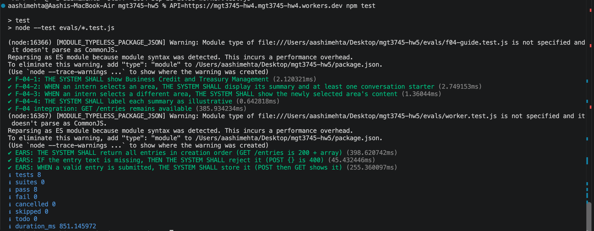
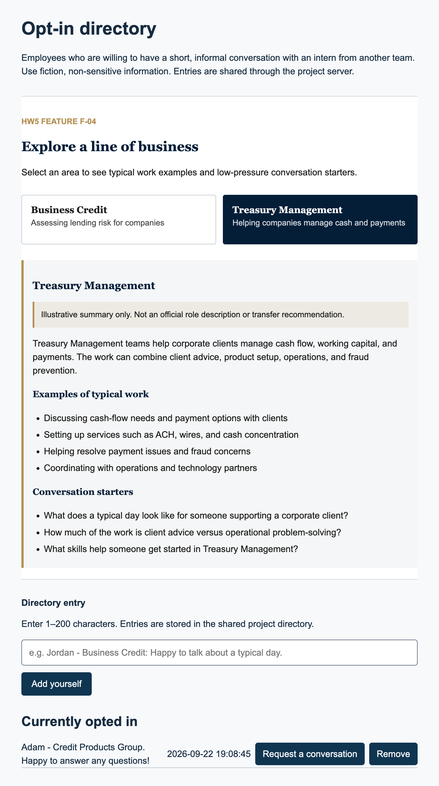
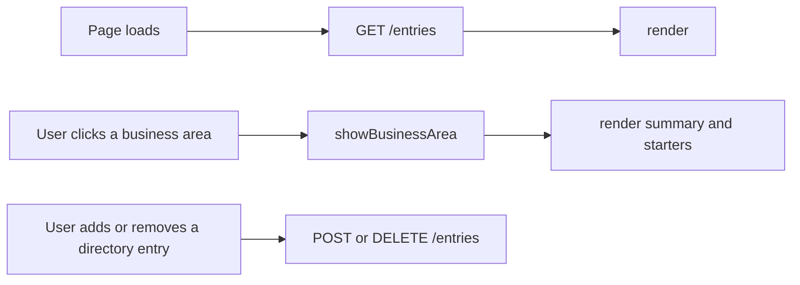

# HW5: delegated F-04 line-of-business guide

This repository delegates the F-04 feature from [context/FEATURES.md](context/FEATURES.md): a static guide to typical work by line of business that helps interns prepare better questions before an informal conversation.

## See It Work

The deployed endpoint is `https://mgt3745-hw4.mgt3745-hw4.workers.dev/entries`.

## How to Run

Deployed Worker: `https://mgt3745-hw4.mgt3745-hw4.workers.dev/`

From a fresh Codespace:

1. Open the repository in a Codespace. The devcontainer installs xdg-utils and runs `npm install`.
2. Run `npx wrangler login --device`, then follow [docs/SESSION_B_COMMANDS.md](docs/SESSION_B_COMMANDS.md) to create the database, run the schema, and deploy.
3. Paste the deployed Worker URL into `app.js` as `API`.
4. Right-click [index.html](index.html) and choose **Open with Live Server**.

Run the code eval with:

`API=https://mgt3745-hw4.mgt3745-hw4.workers.dev npm test`

To run the Worker locally instead: `npm run dev` (port 8787, local D1 emulator).

## Status

- **Code:** 8 of 8 tests passing with the deployed Worker URL.
- **Feature:** 4 of 4 F-04 EARS rows passed in the integrated page.
- **Judgment:** 9 of 10 questions agreed, or 90% agreement.

## Delegation

- [docs/DDR-001.md](docs/DDR-001.md): bolt.new build of the F-04 guide, the integration fixes, and the verification findings.
- [docs/DDR-002.md](docs/DDR-002.md): GitHub Copilot HW4 delegation record for the Worker wiring and verification evidence.
- [docs/COMPARISON.md](docs/COMPARISON.md): the bolt.new versus Google AI Studio comparison note.

## Links

HW4 repository: [mgt3745-hw4](https://github.com/mehtaaashi05/mgt3745-hw4).

Reading order for a stranger: [context/PROJECT.md](context/PROJECT.md) → [context/USERS.md](context/USERS.md) → [context/FEATURES.md](context/FEATURES.md) → [context/ARCHITECTURE.md](context/ARCHITECTURE.md) → [context/STANDARDS.md](context/STANDARDS.md) → [context/TOOLS.md](context/TOOLS.md) → [context/STYLE.md](context/STYLE.md) → [context/EVALS.md](context/EVALS.md) → [context/SKILLS.md](context/SKILLS.md) → [context/CLAUDE.md](context/CLAUDE.md)

## AI Use

Every delegation has a record under the Delegation section above. Hours spent on this assignment: 6.5, with the tool-assisted work and the review recorded in the DDRs.